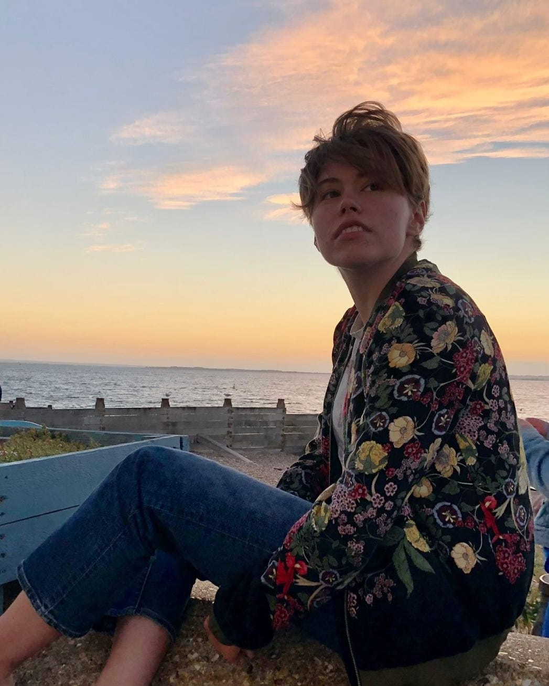
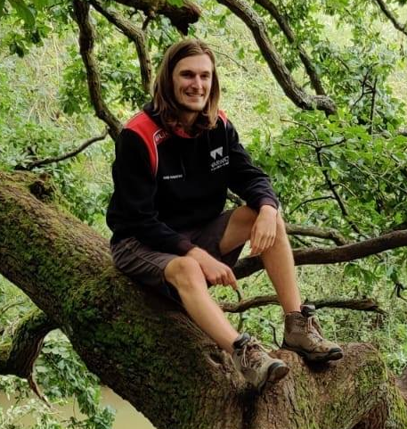

# Helen Norman - President
<!--html_preserve-->

  

    
  

  

  Helen is a fourth year Mathematics student. As President she is responsible for organising trips.
    
  <b>Favourite Climb:</b> <a href="https://www.ukclimbing.com/logbook/crags/coastguard_south-270/walking_the_king-13787" target="_blank">Walking The King, Isle of Portland</a>
  

<!--/html_preserve-->

# David Parmenter - Chairman
<!--html_preserve-->

  

    
  

  

  David was President for the 2021/22 academic year, and is studying for a PhD in Mathematics. His role as Chairman is to advise the President and provide general assistance in the running of WUCU.
    
  <b>Favourite Climb:</b> <a href="https://www.ukclimbing.com/logbook/crags/forest_rock-1171/saucy_sit-start-226278" target="_blank">Saucy Sit Start, Forest Rock</a>
  

<!--/html_preserve-->