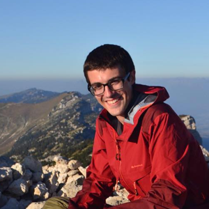
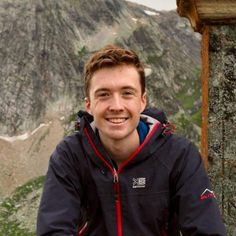
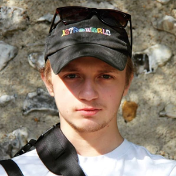
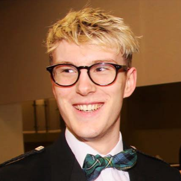

# Edward Plumb - President
<!--html_preserve-->

  

    
  

  

  Ed is a fourth year Mathematics student and is the current Vice President of Warwick University Climbing Club. As President he is the head of WUCU and chief organiser of trips into the great outdoors.
    
  <b>Favourite Climb:</b> <a href="https://www.ukclimbing.com/logbook/crags/espace_comboire-10792/grimpe_avec_elle-594027", target="_blank">Grimpe Avec Elle, Grenoble</a> 
  

<!--/html_preserve-->

# Charlie Henderson - Chairman
<!--html_preserve-->

  

    
  

  

  Charlie is a postgraduate student in Chemistry and a former President of Warwick University Climbing Club. His role as Chairman is to advise the President and provide general assistance in the running of WUCU.
    
  <b>Favourite Climb:</b> <a href= "https://www.ukclimbing.com/logbook/crags/black_rocks_derbyshire-97/sand_buttress-19953" target="_blank">Sand Buttress, Black Rocks</a>
  

<!--/html_preserve-->

# Trigg Sharp - Treasurer
<!--html_preserve-->

  

    
  

  

  Trigg is a third year Engineering student. As treasurer he is responsible for helping to organise trips, managing WUCU's bank account and the collection and distribution of petrol money for trip drivers.
    
  <b>Favourite Climb:</b> <a href="https://www.ukclimbing.com/logbook/crags/corley_rocks-17459/warwickshire_sport-481132" target="_blank">Warwickshire Sport, Corley Rocks</a>
  

<!--/html_preserve-->

# Archie Campbell - Secretary
<!--html_preserve-->

  

    
  

  

  Archie is a third year Mechanical Engineering student. As secretary he is responsible for keeping the BMC up to date with who our members are and corresponding with WUCU members on behalf of the committee.
      
    <b>Favourite Climb:</b> <a href="https://www.ukclimbing.com/logbook/crags/ben_nevis-16877/sassenach-484" target="_blank">Sassenach, Ben Nevis</a>
  

<!--/html_preserve-->