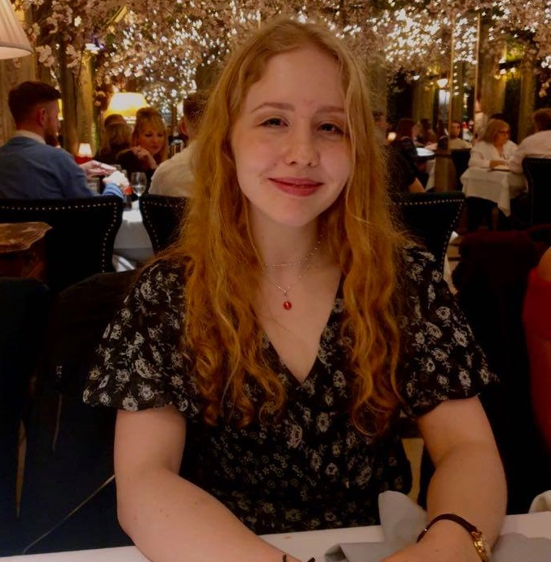

# Trigg Sharp - Co-President
<!--html_preserve-->

  

    
  

  

  Trigg is studying for a masters in Critical Fatness Theory. As Co-President he is one of two chief organisers of trips into the great outdoors.
    
  <b>Favourite Climb:</b> <a href="https://www.ukclimbing.com/logbook/crags/corley_rocks-17459/warwickshire_sport-481132" target="_blank">Warwickshire Sport, Corley Rocks</a>
  

<!--/html_preserve-->

# David Parmenter - Co-President
<!--html_preserve-->

  

    
  

  

  David is studying for a PhD in Physics. As Co-President he is one of two chief organisers of trips into the great outdoors.
    
  <b>Favourite Climb:</b> <a href="https://www.ukclimbing.com/logbook/crags/corley_rocks-17459/warwickshire_sport-481132" target="_blank">Warwickshire Sport, Corley Rocks</a>
  

<!--/html_preserve-->

# Ed Plumb - Chairman
<!--html_preserve-->

  

    
  

  

  Ed Plumb was President for the 2020/21 academic year, and is currently studying Feminist Basket Weaving at the SOAS, University of London. His role as Chairman is to advise the President and provide general assistance in the running of WUCU.
    
  <b>Favourite Climb:</b> <a href="https://www.ukclimbing.com/logbook/crags/espace_comboire-10792/grimpe_avec_elle-594027", target="_blank">Grimpe Avec Elle, Grenoble</a> 
  

<!--/html_preserve-->

# Pip Hyde - Treasurer
<!--html_preserve-->

  

    
  

  

  Pip is a fourth year Mathematics student. As treasurer she is responsible for helping to organise trips, managing WUCU's bank account and the collection and distribution of petrol money for trip drivers.
    
  <b>Favourite Climb:</b> <a href="https://www.ukclimbing.com/logbook/crags/the_dewerstone-206/leviathan-26062" target="_blank">Leviathan, The Dewerstone</a>
  

<!--/html_preserve-->

# Chris Leigh - Secretary
<!--html_preserve-->

  

    
  

  

  Archie is a second year Electrical Engineering student. As secretary he is responsible for keeping the BMC up to date with who our members are and corresponding with WUCU members on behalf of the committee.
      
    <b>Favourite Climb:</b> <a href="https://www.ukclimbing.com/logbook/crags/bowles_rocks-54/hate-1134" target="_blank">Hate, Bowles Rocks</a>
  

<!--/html_preserve-->