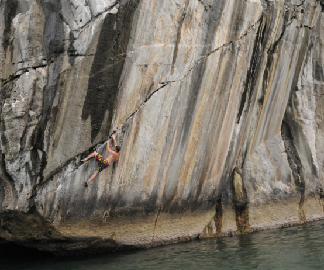
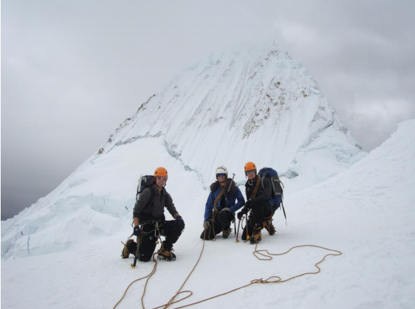
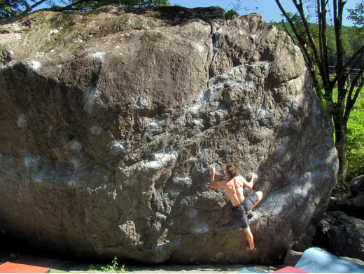

```{r setup, include=FALSE}
knitr::opts_chunk$set(echo = TRUE)
```


<style>
body {
text-align: justify}
</style>

# Lord Rootes Memorial Fund
Over the years several University of Warwick climbers have secured funding for their trips from the [Lord Rootes Memorial Fund](https://warwick.ac.uk/insite/topic/teachinglearning/rootes/). 

The aim of the fund is to *"encourage creativity, innovation and impact through support of projects by individual and groups of Warwick students, especially projects that: Demonstrate innovative and creative thinking; encourage personal development and challenge in pursuit of an idea or objective; create new enterprises, cultural initiatives and/or social impact".* 

Past projects have combined climbing and mountaineering with social outputs such as fundraising, writing English language guidebooks and researching the cultural and economic impact of mountains. Projects can be awarded between £100 and £3,000 in funding. Projects typically take place during the summer vacation. All students can apply, whether full-time or part-time, undergraduate or postgraduate. Successful applicants are required to write a report on their project in return for the funding. Several of these reports are linked below. Good luck!

* [Cycling the Summits - a Fundraising Mission Across the UK (2014)](https://warwick.ac.uk/insite/topic/teachinglearning/rootes/pastprojects/projects2014/betts_philly_and_jack_wicks_-_cycle_the_summits.pdf){target="_blank"}
* [Spiritual Peaks: The Presence and Influence of the High Mountain in Himalayan Religious Culture (2014)](https://warwick.ac.uk/insite/topic/teachinglearning/rootes/pastprojects/projects2014/armstrong_david_and_nessa_fereshteh_-_spiritual_peaks.pdf){target="_blank"}
* [Exploring the Cliffs of Japan to Provide an English Language Guide to Climbing in the Areas Around Tokyo (2014)](https://warwick.ac.uk/insite/topic/teachinglearning/rootes/pastprojects/projects2014/martyn_ben_and_jack_hodgson_-_exploring_the_cliffs_of_japan.pdf){target="_blank"}
* [Climbing the Limestone Cliffs of South East Asia and China (2013)](https://warwick.ac.uk/insite/topic/teachinglearning/rootes/pastprojects/projects2013/walker_elliot_-_an_expedition_to_yangshauo.pdf){target="_blank"}
* [An Expedition to Alpamayo (2011)](https://warwick.ac.uk/insite/topic/teachinglearning/rootes/pastprojects/projects2011/davis_chris_-_report.pdf){target="_blank"}
* [Expedition: High Atlas (2010)](https://warwick.ac.uk/insite/topic/teachinglearning/rootes/pastprojects/projects2010/christopher_damm_-_expedition_high_atlas_2010.pdf){target="_blank"}
* Scaling New Heights: Rock Climbing in Thailand (2008)

# Other Grants
The British Mountaineering Council has [a long list of general mountaineering grants](https://www.thebmc.co.uk/list-of-general-mountaineering-grants). It is worth looking at these to see if any might apply for your expedition. The BMC also has [an expedition grant scheme of its own](https://www.thebmc.co.uk/apply-for-a-bmc-expedition-grant).



<center>Conor on Streak of Lightning, Ha Long Bay, Vietnam</center>


<center>Tom, Chris and Tim in descent after summiting Alpamayo, Peru</center>


<center>Jack on the Ninja Ganeshi boulder, Japan</center>


