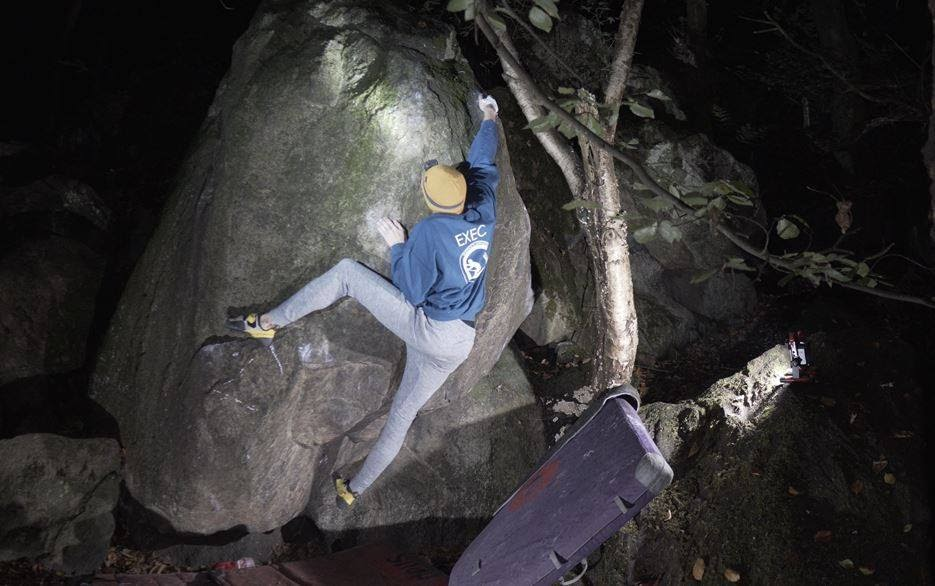

<style>
ol ul {
    margin-bottom: 10px;
}

body {
text-align: justify}
</style>


With the days growing shorter and the clocks about to go back, the possibility of heading out bouldering after lectures/work seems to have gone until Spring. However, for a relatively small amount of money, you can continue to get outside in the evening. Below is some information on what you will need to get started with local lamp sessions, including a list of popular local crags detailing their suitability for lamping and their council district so you can check local lockdown rules.

```{r, echo=FALSE, fig.align='center', out.width = '1500%', fig.cap="Trigg on *Power of Juan f7A* during a lamp session at Cademan Wood"}
library(knitr)

```

## What you will need:

1. A 10-20W portable, cordless, rechargeable work lamp (about £20 from Amazon; [this is the one I have](https://www.amazon.co.uk/dp/B075XMQVVD/ref=pe_3187911_189395841_TE_dp_1){target="_blank"}).
2. A head torch (ideally one per person).
3. (Optional) A second lamp to reduce shadowing. Bike lights also work well.

## How to do it:

1. Select a crag where it is okay to lamp.
2. Get the topo from Leicestershire Bouldering.
3. Position your light so that your body doesn’t cast shadows on the holds you are trying to use.
4. Climb as normal.

## Lamping Best Practice:

1. Don’t light up any boulders that can be seen from houses.
2. When walking around, turn off your main lamps and only use head torches.

## Local Lamping Locations:

```{r, echo=FALSE, layout="l-page"}  
library(kableExtra)
library(readxl)
library(DT)
options(knitr.table.format = "html")
table <- read_excel("lamp_sessions.xlsx")
#table %>% kable() %>%
#  kable_styling(bootstrap_options = c("striped", "hover", "condensed", "responsive"))
datatable(table, rownames = F, options = list(pageLength = 50, dom = "t"))
```

## Illustrative Video
To get an idea of what a lamp session feels like, here is a video made up of clips from a couple of our recent sessions at Curbar (in the Peak District,  unfortunately not in Leicestershire).

```{r, layout="l-body-outset", fig.asp=2}
library(vembedr)
embed_youtube("Szm-v-_4x1E", width = 560, height = 500)
```