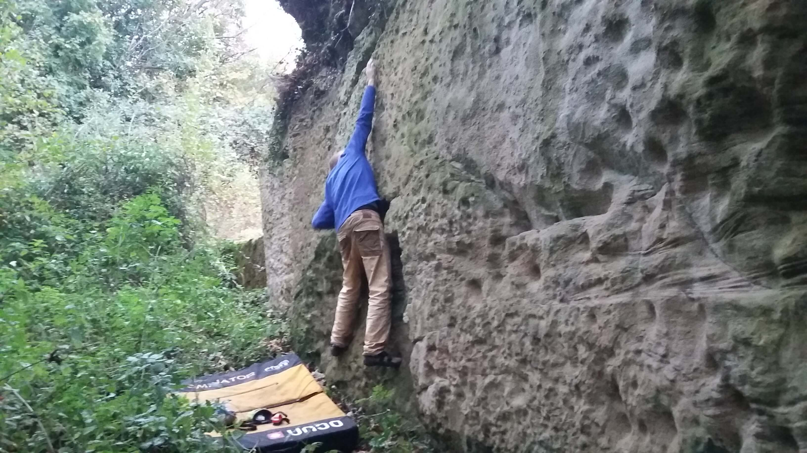
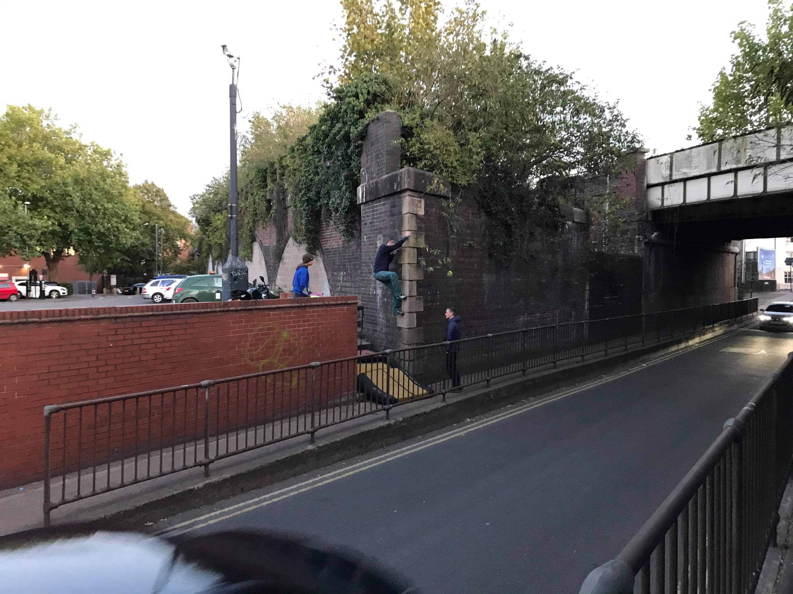
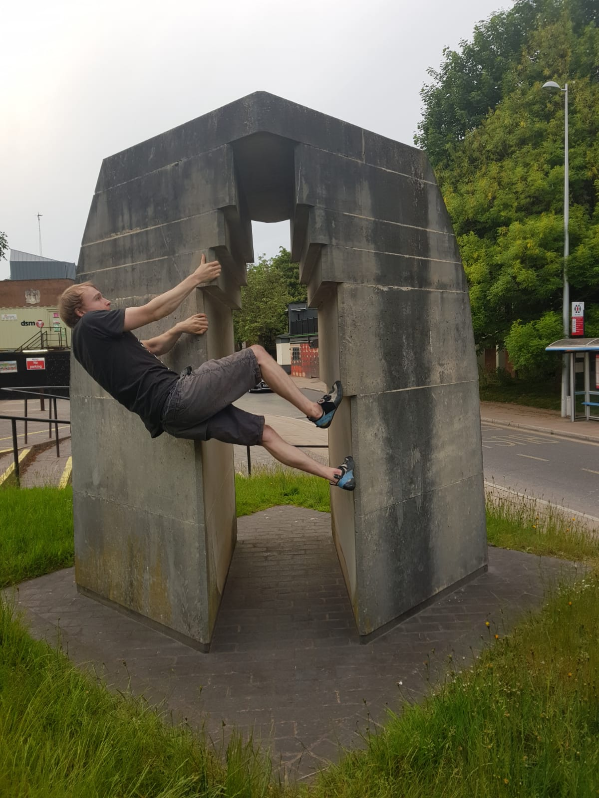
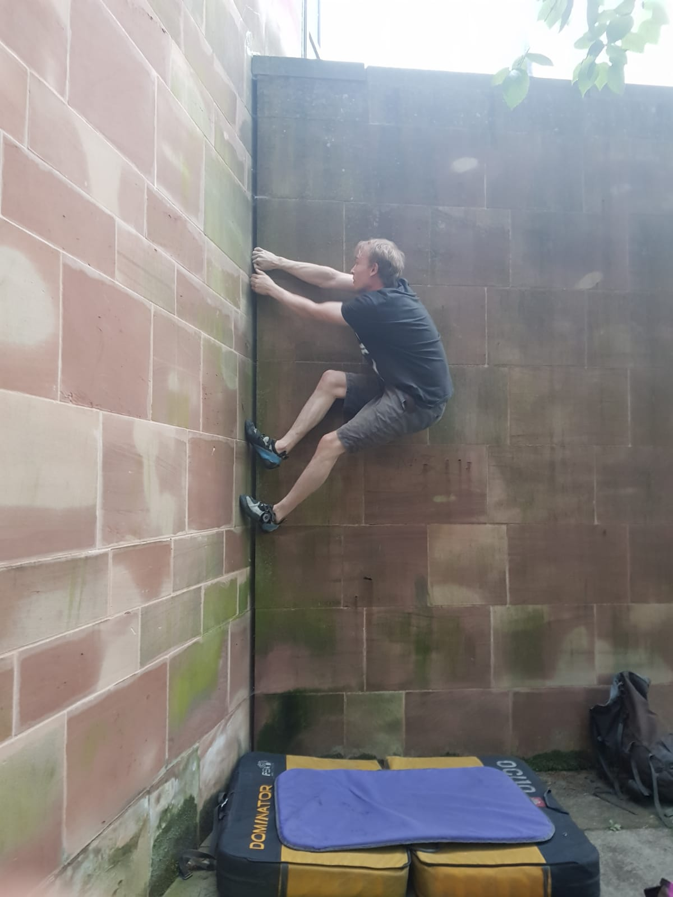

<style>
body {
text-align: justify}
</style>


The car-less life is tough and sometimes it's hard to face the heat and atmosphere of the Sport and Wellness Hub. Luckily there are plenty of options for climbing outside in the local area. None of these crags are brilliant but they always leave you with memorable experiences, experiences that only students stranded at the University of Warwick will ever have. Sometimes a trip during a tough week to somewhere local can be even more satisfying and meaningful than a conventional trip to somewhere like the Peak. It is local adventures such as these that you will laugh about with your mates in the years to come, and that make the experience of being a Warwick climber truly unique.

Below is a brief description of each location, as well as some photos and videos. A link is included to each crag's UKClimbing.com crag database entry. These entries detail the climbs at these crags, how to get there and other useful information. 

# By Train
### Hockley Flyover Underpass, Birmingham
[Hockley Flyover Underpass](https://www.ukclimbing.com/logbook/crag.php?id=26524){target="_blank"} is adorned with the brutalist concrete sculpture of artist William Mitchell.  The scultpures were installed in 1968 and Mitchell intended for them to be climbed on. They have recently rediscovered and publicised by [Brutiful Birmingham](https://www.instagram.com/brutifulbirmingham/){target="_blank"} and [Birmingham University Mountaineering Club](https://www.ubmc.co.uk/brutiful-birmingham-bouldering/){target="_blank"}. 

**How to get there:** Catch the train to Birmingham New Street. Catch the metro from Priory Queensway to Vyse Street, then walk for 6 minutes to the underpass, located at [52.4954,-1.9151](http://maps.google.com/?q=52.4954,-1.9151){target="_blank"}.

<center><iframe width="400" height="500" frameborder="0" src="https://www.bbc.co.uk/news/av/embed/p079ryr0/48342439"></iframe></center>

### The Bournebrook Wall, Birmingham
[The Bournebrook Wall](https://www.ukclimbing.com/logbook/crags/the_bournebrook_wall-10077){target="_blank"} is the Warwick Sport Rock Garden of University of Birmingham, only it's actually good. The wall is made of sandstone blocks 5/6 metres high and some 50 metres long. It has been climbed on by 'The Stoats' of University Birmingham Moountaineering Club for over 50 years. 

**How to get there:** Catch the train to Birmingham New Street. From here catch the train to University. Walk for 5 minutes to the wall, located at [52.44828,-1.93099](http://maps.google.com/?q=52.44828,-1.93099){target="_blank"}.

<center><blockquote class="instagram-media" data-instgrm-captioned data-instgrm-permalink="https://www.instagram.com/p/BTcSkweAEJM/?utm_source=ig_embed&amp;utm_campaign=loading" data-instgrm-version="13" style=" background:#FFF; border:0; border-radius:3px; box-shadow:0 0 1px 0 rgba(0,0,0,0.5),0 1px 10px 0 rgba(0,0,0,0.15); margin: 1px; max-width:540px; min-width:326px; padding:0; width:99.375%; width:-webkit-calc(100% - 2px); width:calc(100% - 2px);"><div style="padding:16px;"> <a href="https://www.instagram.com/p/BTcSkweAEJM/?utm_source=ig_embed&amp;utm_campaign=loading" style=" background:#FFFFFF; line-height:0; padding:0 0; text-align:center; text-decoration:none; width:100%;" target="_blank"> <div style=" display: flex; flex-direction: row; align-items: center;"> <div style="background-color: #F4F4F4; border-radius: 50%; flex-grow: 0; height: 40px; margin-right: 14px; width: 40px;"></div> <div style="display: flex; flex-direction: column; flex-grow: 1; justify-content: center;"> <div style=" background-color: #F4F4F4; border-radius: 4px; flex-grow: 0; height: 14px; margin-bottom: 6px; width: 100px;"></div> <div style=" background-color: #F4F4F4; border-radius: 4px; flex-grow: 0; height: 14px; width: 60px;"></div></div></div><div style="padding: 19% 0;"></div> <div style="display:block; height:50px; margin:0 auto 12px; width:50px;"><svg width="50px" height="50px" viewBox="0 0 60 60" version="1.1" xmlns="https://www.w3.org/2000/svg" xmlns:xlink="https://www.w3.org/1999/xlink"><g stroke="none" stroke-width="1" fill="none" fill-rule="evenodd"><g transform="translate(-511.000000, -20.000000)" fill="#000000"><g><path d="M556.869,30.41 C554.814,30.41 553.148,32.076 553.148,34.131 C553.148,36.186 554.814,37.852 556.869,37.852 C558.924,37.852 560.59,36.186 560.59,34.131 C560.59,32.076 558.924,30.41 556.869,30.41 M541,60.657 C535.114,60.657 530.342,55.887 530.342,50 C530.342,44.114 535.114,39.342 541,39.342 C546.887,39.342 551.658,44.114 551.658,50 C551.658,55.887 546.887,60.657 541,60.657 M541,33.886 C532.1,33.886 524.886,41.1 524.886,50 C524.886,58.899 532.1,66.113 541,66.113 C549.9,66.113 557.115,58.899 557.115,50 C557.115,41.1 549.9,33.886 541,33.886 M565.378,62.101 C565.244,65.022 564.756,66.606 564.346,67.663 C563.803,69.06 563.154,70.057 562.106,71.106 C561.058,72.155 560.06,72.803 558.662,73.347 C557.607,73.757 556.021,74.244 553.102,74.378 C549.944,74.521 548.997,74.552 541,74.552 C533.003,74.552 532.056,74.521 528.898,74.378 C525.979,74.244 524.393,73.757 523.338,73.347 C521.94,72.803 520.942,72.155 519.894,71.106 C518.846,70.057 518.197,69.06 517.654,67.663 C517.244,66.606 516.755,65.022 516.623,62.101 C516.479,58.943 516.448,57.996 516.448,50 C516.448,42.003 516.479,41.056 516.623,37.899 C516.755,34.978 517.244,33.391 517.654,32.338 C518.197,30.938 518.846,29.942 519.894,28.894 C520.942,27.846 521.94,27.196 523.338,26.654 C524.393,26.244 525.979,25.756 528.898,25.623 C532.057,25.479 533.004,25.448 541,25.448 C548.997,25.448 549.943,25.479 553.102,25.623 C556.021,25.756 557.607,26.244 558.662,26.654 C560.06,27.196 561.058,27.846 562.106,28.894 C563.154,29.942 563.803,30.938 564.346,32.338 C564.756,33.391 565.244,34.978 565.378,37.899 C565.522,41.056 565.552,42.003 565.552,50 C565.552,57.996 565.522,58.943 565.378,62.101 M570.82,37.631 C570.674,34.438 570.167,32.258 569.425,30.349 C568.659,28.377 567.633,26.702 565.965,25.035 C564.297,23.368 562.623,22.342 560.652,21.575 C558.743,20.834 556.562,20.326 553.369,20.18 C550.169,20.033 549.148,20 541,20 C532.853,20 531.831,20.033 528.631,20.18 C525.438,20.326 523.257,20.834 521.349,21.575 C519.376,22.342 517.703,23.368 516.035,25.035 C514.368,26.702 513.342,28.377 512.574,30.349 C511.834,32.258 511.326,34.438 511.181,37.631 C511.035,40.831 511,41.851 511,50 C511,58.147 511.035,59.17 511.181,62.369 C511.326,65.562 511.834,67.743 512.574,69.651 C513.342,71.625 514.368,73.296 516.035,74.965 C517.703,76.634 519.376,77.658 521.349,78.425 C523.257,79.167 525.438,79.673 528.631,79.82 C531.831,79.965 532.853,80.001 541,80.001 C549.148,80.001 550.169,79.965 553.369,79.82 C556.562,79.673 558.743,79.167 560.652,78.425 C562.623,77.658 564.297,76.634 565.965,74.965 C567.633,73.296 568.659,71.625 569.425,69.651 C570.167,67.743 570.674,65.562 570.82,62.369 C570.966,59.17 571,58.147 571,50 C571,41.851 570.966,40.831 570.82,37.631"></path></g></g></g></svg></div><div style="padding-top: 8px;"> <div style=" color:#3897f0; font-family:Arial,sans-serif; font-size:14px; font-style:normal; font-weight:550; line-height:18px;"> View this post on Instagram</div></div><div style="padding: 12.5% 0;"></div> <div style="display: flex; flex-direction: row; margin-bottom: 14px; align-items: center;"><div> <div style="background-color: #F4F4F4; border-radius: 50%; height: 12.5px; width: 12.5px; transform: translateX(0px) translateY(7px);"></div> <div style="background-color: #F4F4F4; height: 12.5px; transform: rotate(-45deg) translateX(3px) translateY(1px); width: 12.5px; flex-grow: 0; margin-right: 14px; margin-left: 2px;"></div> <div style="background-color: #F4F4F4; border-radius: 50%; height: 12.5px; width: 12.5px; transform: translateX(9px) translateY(-18px);"></div></div><div style="margin-left: 8px;"> <div style=" background-color: #F4F4F4; border-radius: 50%; flex-grow: 0; height: 20px; width: 20px;"></div> <div style=" width: 0; height: 0; border-top: 2px solid transparent; border-left: 6px solid #f4f4f4; border-bottom: 2px solid transparent; transform: translateX(16px) translateY(-4px) rotate(30deg)"></div></div><div style="margin-left: auto;"> <div style=" width: 0px; border-top: 8px solid #F4F4F4; border-right: 8px solid transparent; transform: translateY(16px);"></div> <div style=" background-color: #F4F4F4; flex-grow: 0; height: 12px; width: 16px; transform: translateY(-4px);"></div> <div style=" width: 0; height: 0; border-top: 8px solid #F4F4F4; border-left: 8px solid transparent; transform: translateY(-4px) translateX(8px);"></div></div></div> <div style="display: flex; flex-direction: column; flex-grow: 1; justify-content: center; margin-bottom: 24px;"> <div style=" background-color: #F4F4F4; border-radius: 4px; flex-grow: 0; height: 14px; margin-bottom: 6px; width: 224px;"></div> <div style=" background-color: #F4F4F4; border-radius: 4px; flex-grow: 0; height: 14px; width: 144px;"></div></div></a><p style=" color:#c9c8cd; font-family:Arial,sans-serif; font-size:14px; line-height:17px; margin-bottom:0; margin-top:8px; overflow:hidden; padding:8px 0 7px; text-align:center; text-overflow:ellipsis; white-space:nowrap;"><a href="https://www.instagram.com/p/BTcSkweAEJM/?utm_source=ig_embed&amp;utm_campaign=loading" style=" color:#c9c8cd; font-family:Arial,sans-serif; font-size:14px; font-style:normal; font-weight:normal; line-height:17px; text-decoration:none;" target="_blank">A post shared by UBMC (@ubmcstoats)</a></p></div></blockquote> <script async src="//www.instagram.com/embed.js"></script></center>


### Robo's Bridge, Marston Green
[Robo's Bridge](https://www.ukclimbing.com/logbook/crags/robos_bridge-21639){target="_blank"} supports the Coventry-Birmingham railway line as it passes over Sheldon Country Park. A couple of good 6Bs and an excellent 7A dyno with a optional hard sit start extension. Catch the train from Coventry, Canley or Tile Hill station and make sure it's one thats stops at Marston Green. The bridge is a short walk from the station. The local people are very friendly and will usually stop for a chat.

**How to get there:** Catch the train to Marston Green. From here walk for 5 minutes to the bridge, located at [52.469,-1.7594](http://maps.google.com/?q=52.469,-1.7594){target="_blank"}.


```{r, fig.asp=2}
library(vembedr)
embed_youtube("fcXAAyDLmtg", width = 560, height = 500)
```

# By Bike
### Radford Railway Viaduct 33A, Radford Semele
[Viaduct 33A](https://www.ukclimbing.com/logbook/crag.php?id=17599){target="_blank"} is a short distance east of Leamngton Spa. It has two good boulder problems on brick arêtes. One graded f5+ and one f6C. These are great fun and in a unique situation next to the canal.

<center> <blockquote class="instagram-media" data-instgrm-captioned data-instgrm-permalink="https://www.instagram.com/p/BbPp-LRlUmf/?utm_source=ig_embed&amp;utm_campaign=loading" data-instgrm-version="13" style=" background:#FFF; border:0; border-radius:3px; box-shadow:0 0 1px 0 rgba(0,0,0,0.5),0 1px 10px 0 rgba(0,0,0,0.15); margin: 1px; max-width:540px; min-width:326px; padding:0; width:99.375%; width:-webkit-calc(100% - 2px); width:calc(100% - 2px);"><div style="padding:16px;"> <a href="https://www.instagram.com/p/BbPp-LRlUmf/?utm_source=ig_embed&amp;utm_campaign=loading" style=" background:#FFFFFF; line-height:0; padding:0 0; text-align:center; text-decoration:none; width:100%;" target="_blank"> <div style=" display: flex; flex-direction: row; align-items: center;"> <div style="background-color: #F4F4F4; border-radius: 50%; flex-grow: 0; height: 40px; margin-right: 14px; width: 40px;"></div> <div style="display: flex; flex-direction: column; flex-grow: 1; justify-content: center;"> <div style=" background-color: #F4F4F4; border-radius: 4px; flex-grow: 0; height: 14px; margin-bottom: 6px; width: 100px;"></div> <div style=" background-color: #F4F4F4; border-radius: 4px; flex-grow: 0; height: 14px; width: 60px;"></div></div></div><div style="padding: 19% 0;"></div> <div style="display:block; height:50px; margin:0 auto 12px; width:50px;"><svg width="50px" height="50px" viewBox="0 0 60 60" version="1.1" xmlns="https://www.w3.org/2000/svg" xmlns:xlink="https://www.w3.org/1999/xlink"><g stroke="none" stroke-width="1" fill="none" fill-rule="evenodd"><g transform="translate(-511.000000, -20.000000)" fill="#000000"><g><path d="M556.869,30.41 C554.814,30.41 553.148,32.076 553.148,34.131 C553.148,36.186 554.814,37.852 556.869,37.852 C558.924,37.852 560.59,36.186 560.59,34.131 C560.59,32.076 558.924,30.41 556.869,30.41 M541,60.657 C535.114,60.657 530.342,55.887 530.342,50 C530.342,44.114 535.114,39.342 541,39.342 C546.887,39.342 551.658,44.114 551.658,50 C551.658,55.887 546.887,60.657 541,60.657 M541,33.886 C532.1,33.886 524.886,41.1 524.886,50 C524.886,58.899 532.1,66.113 541,66.113 C549.9,66.113 557.115,58.899 557.115,50 C557.115,41.1 549.9,33.886 541,33.886 M565.378,62.101 C565.244,65.022 564.756,66.606 564.346,67.663 C563.803,69.06 563.154,70.057 562.106,71.106 C561.058,72.155 560.06,72.803 558.662,73.347 C557.607,73.757 556.021,74.244 553.102,74.378 C549.944,74.521 548.997,74.552 541,74.552 C533.003,74.552 532.056,74.521 528.898,74.378 C525.979,74.244 524.393,73.757 523.338,73.347 C521.94,72.803 520.942,72.155 519.894,71.106 C518.846,70.057 518.197,69.06 517.654,67.663 C517.244,66.606 516.755,65.022 516.623,62.101 C516.479,58.943 516.448,57.996 516.448,50 C516.448,42.003 516.479,41.056 516.623,37.899 C516.755,34.978 517.244,33.391 517.654,32.338 C518.197,30.938 518.846,29.942 519.894,28.894 C520.942,27.846 521.94,27.196 523.338,26.654 C524.393,26.244 525.979,25.756 528.898,25.623 C532.057,25.479 533.004,25.448 541,25.448 C548.997,25.448 549.943,25.479 553.102,25.623 C556.021,25.756 557.607,26.244 558.662,26.654 C560.06,27.196 561.058,27.846 562.106,28.894 C563.154,29.942 563.803,30.938 564.346,32.338 C564.756,33.391 565.244,34.978 565.378,37.899 C565.522,41.056 565.552,42.003 565.552,50 C565.552,57.996 565.522,58.943 565.378,62.101 M570.82,37.631 C570.674,34.438 570.167,32.258 569.425,30.349 C568.659,28.377 567.633,26.702 565.965,25.035 C564.297,23.368 562.623,22.342 560.652,21.575 C558.743,20.834 556.562,20.326 553.369,20.18 C550.169,20.033 549.148,20 541,20 C532.853,20 531.831,20.033 528.631,20.18 C525.438,20.326 523.257,20.834 521.349,21.575 C519.376,22.342 517.703,23.368 516.035,25.035 C514.368,26.702 513.342,28.377 512.574,30.349 C511.834,32.258 511.326,34.438 511.181,37.631 C511.035,40.831 511,41.851 511,50 C511,58.147 511.035,59.17 511.181,62.369 C511.326,65.562 511.834,67.743 512.574,69.651 C513.342,71.625 514.368,73.296 516.035,74.965 C517.703,76.634 519.376,77.658 521.349,78.425 C523.257,79.167 525.438,79.673 528.631,79.82 C531.831,79.965 532.853,80.001 541,80.001 C549.148,80.001 550.169,79.965 553.369,79.82 C556.562,79.673 558.743,79.167 560.652,78.425 C562.623,77.658 564.297,76.634 565.965,74.965 C567.633,73.296 568.659,71.625 569.425,69.651 C570.167,67.743 570.674,65.562 570.82,62.369 C570.966,59.17 571,58.147 571,50 C571,41.851 570.966,40.831 570.82,37.631"></path></g></g></g></svg></div><div style="padding-top: 8px;"> <div style=" color:#3897f0; font-family:Arial,sans-serif; font-size:14px; font-style:normal; font-weight:550; line-height:18px;"> View this post on Instagram</div></div><div style="padding: 12.5% 0;"></div> <div style="display: flex; flex-direction: row; margin-bottom: 14px; align-items: center;"><div> <div style="background-color: #F4F4F4; border-radius: 50%; height: 12.5px; width: 12.5px; transform: translateX(0px) translateY(7px);"></div> <div style="background-color: #F4F4F4; height: 12.5px; transform: rotate(-45deg) translateX(3px) translateY(1px); width: 12.5px; flex-grow: 0; margin-right: 14px; margin-left: 2px;"></div> <div style="background-color: #F4F4F4; border-radius: 50%; height: 12.5px; width: 12.5px; transform: translateX(9px) translateY(-18px);"></div></div><div style="margin-left: 8px;"> <div style=" background-color: #F4F4F4; border-radius: 50%; flex-grow: 0; height: 20px; width: 20px;"></div> <div style=" width: 0; height: 0; border-top: 2px solid transparent; border-left: 6px solid #f4f4f4; border-bottom: 2px solid transparent; transform: translateX(16px) translateY(-4px) rotate(30deg)"></div></div><div style="margin-left: auto;"> <div style=" width: 0px; border-top: 8px solid #F4F4F4; border-right: 8px solid transparent; transform: translateY(16px);"></div> <div style=" background-color: #F4F4F4; flex-grow: 0; height: 12px; width: 16px; transform: translateY(-4px);"></div> <div style=" width: 0; height: 0; border-top: 8px solid #F4F4F4; border-left: 8px solid transparent; transform: translateY(-4px) translateX(8px);"></div></div></div> <div style="display: flex; flex-direction: column; flex-grow: 1; justify-content: center; margin-bottom: 24px;"> <div style=" background-color: #F4F4F4; border-radius: 4px; flex-grow: 0; height: 14px; margin-bottom: 6px; width: 224px;"></div> <div style=" background-color: #F4F4F4; border-radius: 4px; flex-grow: 0; height: 14px; width: 144px;"></div></div></a><p style=" color:#c9c8cd; font-family:Arial,sans-serif; font-size:14px; line-height:17px; margin-bottom:0; margin-top:8px; overflow:hidden; padding:8px 0 7px; text-align:center; text-overflow:ellipsis; white-space:nowrap;"><a href="https://www.instagram.com/p/BbPp-LRlUmf/?utm_source=ig_embed&amp;utm_campaign=loading" style=" color:#c9c8cd; font-family:Arial,sans-serif; font-size:14px; font-style:normal; font-weight:normal; line-height:17px; text-decoration:none;" target="_blank">A post shared by Warwick Uni Climbing Club (@w_u_c_c)</a></p></div></blockquote> <script async src="//www.instagram.com/embed.js"></script></center>

### Corley Rocks, Corley
[Corley Rocks](https://www.ukclimbing.com/logbook/crag.php?id=17459){target="_blank"} is a hilarious soft sandstone crag not far from Coventry. It has a couple of decent boulder problems, an ancient and dangerous sport climb, and a trad route. Worth a visit or two to get these things done. Please don't climb on the rock if it is wet or damp.

```{r, fig.asp=2}
library(vembedr)
embed_youtube("4rTKJErjj0s", width = 560, height = 500)
```

### North Woodloes Quarry, Leek Wooton
[North Woodloes Quarry](https://www.ukclimbing.com/logbook/crag.php?id=21934){target="_blank"} is not far from Leamington and seemingly made entirely out of sand. It is only really climbable during dry spells in summer. There are some easy problems on 'natural' features and some harder problems which have been chipped out of the rock by a naughty person. Please don't climb on the rock if it is wet or damp.



# On Foot (and Bus)
### Wedgnock Lane Bridge 50A, Warwick
A recently discovered bridge crack over the Grand Union Canal. First traversed by Tom Randall to give the route 'Bassline' 5.12c (F7b-ish).

<center><blockquote class="instagram-media" data-instgrm-captioned data-instgrm-permalink="https://www.instagram.com/p/CIkzXRgjCDq/?utm_source=ig_embed&amp;utm_campaign=loading" data-instgrm-version="13" style=" background:#FFF; border:0; border-radius:3px; box-shadow:0 0 1px 0 rgba(0,0,0,0.5),0 1px 10px 0 rgba(0,0,0,0.15); margin: 1px; max-width:540px; min-width:326px; padding:0; width:99.375%; width:-webkit-calc(100% - 2px); width:calc(100% - 2px);"><div style="padding:16px;"> <a href="https://www.instagram.com/p/CIkzXRgjCDq/?utm_source=ig_embed&amp;utm_campaign=loading" style=" background:#FFFFFF; line-height:0; padding:0 0; text-align:center; text-decoration:none; width:100%;" target="_blank"> <div style=" display: flex; flex-direction: row; align-items: center;"> <div style="background-color: #F4F4F4; border-radius: 50%; flex-grow: 0; height: 40px; margin-right: 14px; width: 40px;"></div> <div style="display: flex; flex-direction: column; flex-grow: 1; justify-content: center;"> <div style=" background-color: #F4F4F4; border-radius: 4px; flex-grow: 0; height: 14px; margin-bottom: 6px; width: 100px;"></div> <div style=" background-color: #F4F4F4; border-radius: 4px; flex-grow: 0; height: 14px; width: 60px;"></div></div></div><div style="padding: 19% 0;"></div> <div style="display:block; height:50px; margin:0 auto 12px; width:50px;"><svg width="50px" height="50px" viewBox="0 0 60 60" version="1.1" xmlns="https://www.w3.org/2000/svg" xmlns:xlink="https://www.w3.org/1999/xlink"><g stroke="none" stroke-width="1" fill="none" fill-rule="evenodd"><g transform="translate(-511.000000, -20.000000)" fill="#000000"><g><path d="M556.869,30.41 C554.814,30.41 553.148,32.076 553.148,34.131 C553.148,36.186 554.814,37.852 556.869,37.852 C558.924,37.852 560.59,36.186 560.59,34.131 C560.59,32.076 558.924,30.41 556.869,30.41 M541,60.657 C535.114,60.657 530.342,55.887 530.342,50 C530.342,44.114 535.114,39.342 541,39.342 C546.887,39.342 551.658,44.114 551.658,50 C551.658,55.887 546.887,60.657 541,60.657 M541,33.886 C532.1,33.886 524.886,41.1 524.886,50 C524.886,58.899 532.1,66.113 541,66.113 C549.9,66.113 557.115,58.899 557.115,50 C557.115,41.1 549.9,33.886 541,33.886 M565.378,62.101 C565.244,65.022 564.756,66.606 564.346,67.663 C563.803,69.06 563.154,70.057 562.106,71.106 C561.058,72.155 560.06,72.803 558.662,73.347 C557.607,73.757 556.021,74.244 553.102,74.378 C549.944,74.521 548.997,74.552 541,74.552 C533.003,74.552 532.056,74.521 528.898,74.378 C525.979,74.244 524.393,73.757 523.338,73.347 C521.94,72.803 520.942,72.155 519.894,71.106 C518.846,70.057 518.197,69.06 517.654,67.663 C517.244,66.606 516.755,65.022 516.623,62.101 C516.479,58.943 516.448,57.996 516.448,50 C516.448,42.003 516.479,41.056 516.623,37.899 C516.755,34.978 517.244,33.391 517.654,32.338 C518.197,30.938 518.846,29.942 519.894,28.894 C520.942,27.846 521.94,27.196 523.338,26.654 C524.393,26.244 525.979,25.756 528.898,25.623 C532.057,25.479 533.004,25.448 541,25.448 C548.997,25.448 549.943,25.479 553.102,25.623 C556.021,25.756 557.607,26.244 558.662,26.654 C560.06,27.196 561.058,27.846 562.106,28.894 C563.154,29.942 563.803,30.938 564.346,32.338 C564.756,33.391 565.244,34.978 565.378,37.899 C565.522,41.056 565.552,42.003 565.552,50 C565.552,57.996 565.522,58.943 565.378,62.101 M570.82,37.631 C570.674,34.438 570.167,32.258 569.425,30.349 C568.659,28.377 567.633,26.702 565.965,25.035 C564.297,23.368 562.623,22.342 560.652,21.575 C558.743,20.834 556.562,20.326 553.369,20.18 C550.169,20.033 549.148,20 541,20 C532.853,20 531.831,20.033 528.631,20.18 C525.438,20.326 523.257,20.834 521.349,21.575 C519.376,22.342 517.703,23.368 516.035,25.035 C514.368,26.702 513.342,28.377 512.574,30.349 C511.834,32.258 511.326,34.438 511.181,37.631 C511.035,40.831 511,41.851 511,50 C511,58.147 511.035,59.17 511.181,62.369 C511.326,65.562 511.834,67.743 512.574,69.651 C513.342,71.625 514.368,73.296 516.035,74.965 C517.703,76.634 519.376,77.658 521.349,78.425 C523.257,79.167 525.438,79.673 528.631,79.82 C531.831,79.965 532.853,80.001 541,80.001 C549.148,80.001 550.169,79.965 553.369,79.82 C556.562,79.673 558.743,79.167 560.652,78.425 C562.623,77.658 564.297,76.634 565.965,74.965 C567.633,73.296 568.659,71.625 569.425,69.651 C570.167,67.743 570.674,65.562 570.82,62.369 C570.966,59.17 571,58.147 571,50 C571,41.851 570.966,40.831 570.82,37.631"></path></g></g></g></svg></div><div style="padding-top: 8px;"> <div style=" color:#3897f0; font-family:Arial,sans-serif; font-size:14px; font-style:normal; font-weight:550; line-height:18px;"> View this post on Instagram</div></div><div style="padding: 12.5% 0;"></div> <div style="display: flex; flex-direction: row; margin-bottom: 14px; align-items: center;"><div> <div style="background-color: #F4F4F4; border-radius: 50%; height: 12.5px; width: 12.5px; transform: translateX(0px) translateY(7px);"></div> <div style="background-color: #F4F4F4; height: 12.5px; transform: rotate(-45deg) translateX(3px) translateY(1px); width: 12.5px; flex-grow: 0; margin-right: 14px; margin-left: 2px;"></div> <div style="background-color: #F4F4F4; border-radius: 50%; height: 12.5px; width: 12.5px; transform: translateX(9px) translateY(-18px);"></div></div><div style="margin-left: 8px;"> <div style=" background-color: #F4F4F4; border-radius: 50%; flex-grow: 0; height: 20px; width: 20px;"></div> <div style=" width: 0; height: 0; border-top: 2px solid transparent; border-left: 6px solid #f4f4f4; border-bottom: 2px solid transparent; transform: translateX(16px) translateY(-4px) rotate(30deg)"></div></div><div style="margin-left: auto;"> <div style=" width: 0px; border-top: 8px solid #F4F4F4; border-right: 8px solid transparent; transform: translateY(16px);"></div> <div style=" background-color: #F4F4F4; flex-grow: 0; height: 12px; width: 16px; transform: translateY(-4px);"></div> <div style=" width: 0; height: 0; border-top: 8px solid #F4F4F4; border-left: 8px solid transparent; transform: translateY(-4px) translateX(8px);"></div></div></div> <div style="display: flex; flex-direction: column; flex-grow: 1; justify-content: center; margin-bottom: 24px;"> <div style=" background-color: #F4F4F4; border-radius: 4px; flex-grow: 0; height: 14px; margin-bottom: 6px; width: 224px;"></div> <div style=" background-color: #F4F4F4; border-radius: 4px; flex-grow: 0; height: 14px; width: 144px;"></div></div></a><p style=" color:#c9c8cd; font-family:Arial,sans-serif; font-size:14px; line-height:17px; margin-bottom:0; margin-top:8px; overflow:hidden; padding:8px 0 7px; text-align:center; text-overflow:ellipsis; white-space:nowrap;"><a href="https://www.instagram.com/p/CIkzXRgjCDq/?utm_source=ig_embed&amp;utm_campaign=loading" style=" color:#c9c8cd; font-family:Arial,sans-serif; font-size:14px; font-style:normal; font-weight:normal; line-height:17px; text-decoration:none;" target="_blank">A post shared by Wide_boyz (@wide_boyz)</a></p></div></blockquote> <script async src="//www.instagram.com/embed.js"></script></center>

### Leamington Spa
A few problems have been developed around South Leamington. Specifically on the [High Street Bridge](https://www.ukclimbing.com/logbook/crag.php?id=25459){target="_blank"} and [Bath Street Viaducts](https://www.ukclimbing.com/logbook/crag.php?id=28257){target="_blank"}. The [Blue Wave sculpture](https://commons.wikimedia.org/wiki/File:Blue_waves_-_The_Jug_%26_Jester_-_Bath_Street,_Leamington_Spa.jpg){target="_blank"} outside All Saints Church / The Old Library is also a laugh. The [Princes Drive Viaducts](https://goo.gl/maps/Z8vyiXtadbBmrAYx7){target="_blank"} have been climbed on in the past and may provide good sport.



### Campus
The [University campus](https://www.ukclimbing.com/logbook/crag.php?id=24998){target="_blank"} has a number of boulder problems ranging from good quality to utter rubbish. These are good for a laugh after an evening at the Duck or for blowing off steam if you live on campus. The best spots are listed below but there is plenty more documented on UKC.

* [3B Series I by Bernard Schottlander](https://warwick.ac.uk/services/art/artist/bernardschottlander/wu0196/){target="_blank"} (aka Toil) is home to several problems and is located in Red Square next to Old Rootes. The best problems are [Trouble V3/f6A](https://www.youtube.com/watch?v=wwixj147cDM){target="_blank"}, [And V4/f6B](https://www.youtube.com/watch?v=X6xMzc1QqrY){target="_blank"} and Toil V2/f5+. Best climbed with bare feet!
* The Engineering Department has a few problems based around [an arête](https://www.ukclimbing.com/photos/dbpage.php?id=354006){target="_blank"}. The arête is located to the right of the steps to the entrance, below the bike racks. The roof keep these problems permanently dry!
* Petroleum Wall is the name given to the wall below the railings outside the Modern Records Centre/BP Archive. The wall using everything is a classic and dynoing from the second break to the top is worth V6/f7A!
* The Humanities Rock garden is home to the best problems on real rock. [Attack Goose V1/f5](https://youtu.be/VH7hELva7MA){target="_blank"} and [Cristo El Redentor V0/f4+](https://youtu.be/GKD-vgZwgiU) are essential!

```{r, fig.asp=2}
library(vembedr)
embed_youtube("-RubEL7sqZg", width = 560, height = 500)
```

### Coventry
The city centre has plenty of things to climb about on. Pictured here are [Basilica by Paul De Menchaux](https://www.coventrysociety.org.uk/public-art-in-coventry/basilica-by-paul-de-monchaux.html){target="_blank"} (Portland Limestone) and [Herbert Crack](https://goo.gl/maps/hzn2Grwmcf21qnzv5){target="_blank"} (sandstone, loose top hold). There is plenty more to be discovered.

{ width=49% } { width=49% }

### Map
<center>
```{r, echo=FALSE, results = 'asis'}  
library(leaflet)

hill_icons <- icons(
  iconUrl = "https://emojipedia-us.s3.dualstack.us-west-1.amazonaws.com/thumbs/120/twitter/259/mountain_26f0.png",
  iconWidth = 30, iconHeight = 30
)

uni_icons  <- icons(
  iconUrl = "https://emojipedia-us.s3.dualstack.us-west-1.amazonaws.com/thumbs/120/joypixels/257/graduation-cap_1f393.png",
  iconWidth = 30, iconHeight = 30
)

bridge_icons <- icons(
  iconUrl = "https://emojipedia-us.s3.dualstack.us-west-1.amazonaws.com/thumbs/120/facebook/65/bridge-at-night_1f309.png",
  iconWidth = 30, iconHeight = 30
)

building_icons <- icons(
  iconUrl = "https://emojipedia-us.s3.dualstack.us-west-1.amazonaws.com/thumbs/120/google/263/brick_1f9f1.png",
  iconWidth = 30, iconHeight = 30
)

leaflet() %>%
  addTiles() %>%
  addMarkers(lat=52.4954, lng=-1.9151, popup="Hockley Flyover Underpass <br> By: Train <br> Rocktype: Concrete", icon = bridge_icons) %>%
  addMarkers(lat=52.44828, lng=-1.93099, popup="The Bournebrook Wall <br> By: Train <br> Rocktype: Sandstone", icon = building_icons) %>%
  addMarkers(lat=52.469, lng=-1.7594, popup="Robo's Bridge<br> By: Train <br> Rocktype: Brick", icon = bridge_icons) %>%
  addMarkers(lat=52.281, lng=-1.48351, popup="Radford Railway Viaduct 33A <br> By: Bike <br> Rocktype: Brick", icon = bridge_icons) %>%
  addMarkers(lat=52.4641, lng=-1.5545, popup="Corley Rocks <br> By: Bike <br> Rocktype: Sandstone", icon = hill_icons) %>%
  addMarkers(lat=52.30926, lng=-1.59641, popup="North Woodloes Quarry <br> By: Bike <br> Rocktype: Sandstone", icon = hill_icons) %>%
  addMarkers(lat=52.290782673022, lng=-1.599678866640048, popup="Wedgenock Lane Bridge 50A <br> By: Foot / Bus <br> Rocktype: Concrete", icon = bridge_icons) %>%
  addMarkers(lat=52.28479, lng=-1.53424, popup="Leamington Spa <br> By: Foot / Bus <br> Rocktype: Sandstone", icon = building_icons) %>%
  
  addMarkers(lat=52.37778, lng=-1.5699, popup="University of Warwick", icon = uni_icons)

```
</center>
