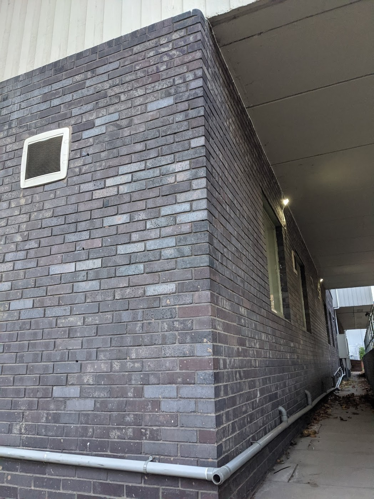
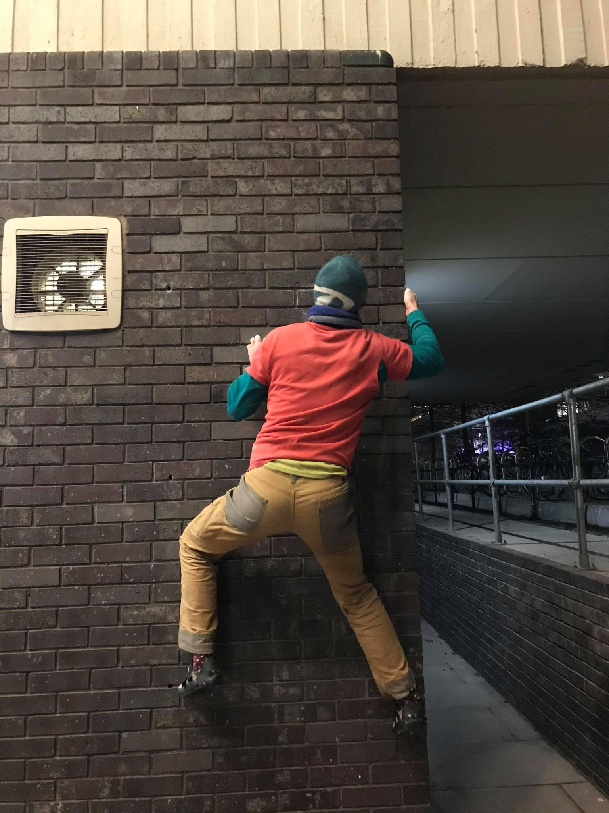

<style>
body {
text-align: justify}
</style>


This article details the outdoor options available to University of Warwick students when it is, or has been, raining. There are two classes of weather-proof venues. The first are steep and overhanging crags that are typically home to hard boulder problems and sport climbs. The second are artificial structures with ceilings, such as bridges and buildings. 

# Weather-Proof Crags
### Forest Rock, Charnwood, Leicestershire
[Forest Rock](https://www.ukclimbing.com/logbook/crags/forest_rock-1171){target="_blank"} is a cave tucked away in the sleepy town of Woodhouse Eaves. The problems from Sorcerer to Sorceress are permanently dry aside from some dryable drips. The problems further into the cave are more uncertain, sometimes they can be bone dry despite recent torrential rain and sometimes they can be inexplicably wet during a dry spell. Luckily Forest Rock is only 45 minutes from campus so it's not the end of the world if it's wet. There is usually something to do that is dry and worse comes to worst you can always drive over to [Rothley Brook Bridge](https://www.ukclimbing.com/logbook/crags/rothley_brook_bridge-25960){target="_blank"} for some truly perma-dry action.

```{r, fig.asp=2, echo = FALSE}
library(vembedr)
embed_youtube("QXtLtjhjdO0", width = 560, height = 500)
```

### Madawag Rock Shelter (Biblins Cave), Forest of Dean, Herefordshire
[Madawag Rock Shelter (Biblins Cave)](https://www.ukclimbing.com/logbook/crags/biblins_cave-20666){target="_blank"} is a large limestone cave. Unfortunately it is only open from 1st May to 30th September. Pop For The Top does get wet from rain but the other problems don't get wet other than from condensation. 

```{r, fig.asp=2, echo = FALSE}
library(vembedr)
embed_youtube("ngWcd3wjUfE", width = 560, height = 500)
```

### Raven Tor, Peak District, Derbyshire
[Raven Tor](https://www.ukclimbing.com/logbook/crags/raven_tor_millers_dale-146){target="_blank"} is reliably dry once it has dried out in Spring, but iffy in late Autumn and Winter. Much of the sport climbing will stay dry in the rain during the summer too. Ben's Roof is famous for being climbable no matter the conditions. [Blackwell Dale](https://www.ukclimbing.com/logbook/crag.php?id=965){target="_blank"} is also worth a look as you drive past it on the way to Raven Tor from Coventry. 

```{r, fig.asp=2, echo = FALSE}
library(vembedr)
embed_youtube("EZk2qiYrEZM", width = 560, height = 500)
```

### Water-Cum-Jolly (Rubicon), Peak District, Derbyshire
The routes around the roof of [Rubicon](https://www.ukclimbing.com/logbook/crag.php?id=140){target="_blank"} are reliably dry but the approach area can go underwater if there has been a deluge. Kudos Wall stays dry in light rain and the floor is higher than the approach, so if you have some wellies to get past the flooded approach it can be an option. However, if it has been raining long and hard enough then will get wet from runoff and in very wet periods even the ground under Kudos can flood. The [River Wye GaugeMap](https://www.gaugemap.co.uk/?fbclid=IwAR0nQ9bSNGCOSKNVHkBpbZTpL6i8pY7VHmDkfWeVEcQoUtLISPp1OZ8nyZY#!Map/Summary/131/137){target="_blank"} keeps track of the river level and will indicate if the river has flooded.

<center><blockquote class="instagram-media" data-instgrm-captioned data-instgrm-permalink="https://www.instagram.com/p/CHBJD3JFA3Q/?utm_source=ig_embed&amp;utm_campaign=loading" data-instgrm-version="13" style=" background:#FFF; border:0; border-radius:3px; box-shadow:0 0 1px 0 rgba(0,0,0,0.5),0 1px 10px 0 rgba(0,0,0,0.15); margin: 1px; max-width:540px; min-width:326px; padding:0; width:99.375%; width:-webkit-calc(100% - 2px); width:calc(100% - 2px);"><div style="padding:16px;"> <a href="https://www.instagram.com/p/CHBJD3JFA3Q/?utm_source=ig_embed&amp;utm_campaign=loading" style=" background:#FFFFFF; line-height:0; padding:0 0; text-align:center; text-decoration:none; width:100%;" target="_blank"> <div style=" display: flex; flex-direction: row; align-items: center;"> <div style="background-color: #F4F4F4; border-radius: 50%; flex-grow: 0; height: 40px; margin-right: 14px; width: 40px;"></div> <div style="display: flex; flex-direction: column; flex-grow: 1; justify-content: center;"> <div style=" background-color: #F4F4F4; border-radius: 4px; flex-grow: 0; height: 14px; margin-bottom: 6px; width: 100px;"></div> <div style=" background-color: #F4F4F4; border-radius: 4px; flex-grow: 0; height: 14px; width: 60px;"></div></div></div><div style="padding: 19% 0;"></div> <div style="display:block; height:50px; margin:0 auto 12px; width:50px;"><svg width="50px" height="50px" viewBox="0 0 60 60" version="1.1" xmlns="https://www.w3.org/2000/svg" xmlns:xlink="https://www.w3.org/1999/xlink"><g stroke="none" stroke-width="1" fill="none" fill-rule="evenodd"><g transform="translate(-511.000000, -20.000000)" fill="#000000"><g><path d="M556.869,30.41 C554.814,30.41 553.148,32.076 553.148,34.131 C553.148,36.186 554.814,37.852 556.869,37.852 C558.924,37.852 560.59,36.186 560.59,34.131 C560.59,32.076 558.924,30.41 556.869,30.41 M541,60.657 C535.114,60.657 530.342,55.887 530.342,50 C530.342,44.114 535.114,39.342 541,39.342 C546.887,39.342 551.658,44.114 551.658,50 C551.658,55.887 546.887,60.657 541,60.657 M541,33.886 C532.1,33.886 524.886,41.1 524.886,50 C524.886,58.899 532.1,66.113 541,66.113 C549.9,66.113 557.115,58.899 557.115,50 C557.115,41.1 549.9,33.886 541,33.886 M565.378,62.101 C565.244,65.022 564.756,66.606 564.346,67.663 C563.803,69.06 563.154,70.057 562.106,71.106 C561.058,72.155 560.06,72.803 558.662,73.347 C557.607,73.757 556.021,74.244 553.102,74.378 C549.944,74.521 548.997,74.552 541,74.552 C533.003,74.552 532.056,74.521 528.898,74.378 C525.979,74.244 524.393,73.757 523.338,73.347 C521.94,72.803 520.942,72.155 519.894,71.106 C518.846,70.057 518.197,69.06 517.654,67.663 C517.244,66.606 516.755,65.022 516.623,62.101 C516.479,58.943 516.448,57.996 516.448,50 C516.448,42.003 516.479,41.056 516.623,37.899 C516.755,34.978 517.244,33.391 517.654,32.338 C518.197,30.938 518.846,29.942 519.894,28.894 C520.942,27.846 521.94,27.196 523.338,26.654 C524.393,26.244 525.979,25.756 528.898,25.623 C532.057,25.479 533.004,25.448 541,25.448 C548.997,25.448 549.943,25.479 553.102,25.623 C556.021,25.756 557.607,26.244 558.662,26.654 C560.06,27.196 561.058,27.846 562.106,28.894 C563.154,29.942 563.803,30.938 564.346,32.338 C564.756,33.391 565.244,34.978 565.378,37.899 C565.522,41.056 565.552,42.003 565.552,50 C565.552,57.996 565.522,58.943 565.378,62.101 M570.82,37.631 C570.674,34.438 570.167,32.258 569.425,30.349 C568.659,28.377 567.633,26.702 565.965,25.035 C564.297,23.368 562.623,22.342 560.652,21.575 C558.743,20.834 556.562,20.326 553.369,20.18 C550.169,20.033 549.148,20 541,20 C532.853,20 531.831,20.033 528.631,20.18 C525.438,20.326 523.257,20.834 521.349,21.575 C519.376,22.342 517.703,23.368 516.035,25.035 C514.368,26.702 513.342,28.377 512.574,30.349 C511.834,32.258 511.326,34.438 511.181,37.631 C511.035,40.831 511,41.851 511,50 C511,58.147 511.035,59.17 511.181,62.369 C511.326,65.562 511.834,67.743 512.574,69.651 C513.342,71.625 514.368,73.296 516.035,74.965 C517.703,76.634 519.376,77.658 521.349,78.425 C523.257,79.167 525.438,79.673 528.631,79.82 C531.831,79.965 532.853,80.001 541,80.001 C549.148,80.001 550.169,79.965 553.369,79.82 C556.562,79.673 558.743,79.167 560.652,78.425 C562.623,77.658 564.297,76.634 565.965,74.965 C567.633,73.296 568.659,71.625 569.425,69.651 C570.167,67.743 570.674,65.562 570.82,62.369 C570.966,59.17 571,58.147 571,50 C571,41.851 570.966,40.831 570.82,37.631"></path></g></g></g></svg></div><div style="padding-top: 8px;"> <div style=" color:#3897f0; font-family:Arial,sans-serif; font-size:14px; font-style:normal; font-weight:550; line-height:18px;"> View this post on Instagram</div></div><div style="padding: 12.5% 0;"></div> <div style="display: flex; flex-direction: row; margin-bottom: 14px; align-items: center;"><div> <div style="background-color: #F4F4F4; border-radius: 50%; height: 12.5px; width: 12.5px; transform: translateX(0px) translateY(7px);"></div> <div style="background-color: #F4F4F4; height: 12.5px; transform: rotate(-45deg) translateX(3px) translateY(1px); width: 12.5px; flex-grow: 0; margin-right: 14px; margin-left: 2px;"></div> <div style="background-color: #F4F4F4; border-radius: 50%; height: 12.5px; width: 12.5px; transform: translateX(9px) translateY(-18px);"></div></div><div style="margin-left: 8px;"> <div style=" background-color: #F4F4F4; border-radius: 50%; flex-grow: 0; height: 20px; width: 20px;"></div> <div style=" width: 0; height: 0; border-top: 2px solid transparent; border-left: 6px solid #f4f4f4; border-bottom: 2px solid transparent; transform: translateX(16px) translateY(-4px) rotate(30deg)"></div></div><div style="margin-left: auto;"> <div style=" width: 0px; border-top: 8px solid #F4F4F4; border-right: 8px solid transparent; transform: translateY(16px);"></div> <div style=" background-color: #F4F4F4; flex-grow: 0; height: 12px; width: 16px; transform: translateY(-4px);"></div> <div style=" width: 0; height: 0; border-top: 8px solid #F4F4F4; border-left: 8px solid transparent; transform: translateY(-4px) translateX(8px);"></div></div></div> <div style="display: flex; flex-direction: column; flex-grow: 1; justify-content: center; margin-bottom: 24px;"> <div style=" background-color: #F4F4F4; border-radius: 4px; flex-grow: 0; height: 14px; margin-bottom: 6px; width: 224px;"></div> <div style=" background-color: #F4F4F4; border-radius: 4px; flex-grow: 0; height: 14px; width: 144px;"></div></div></a><p style=" color:#c9c8cd; font-family:Arial,sans-serif; font-size:14px; line-height:17px; margin-bottom:0; margin-top:8px; overflow:hidden; padding:8px 0 7px; text-align:center; text-overflow:ellipsis; white-space:nowrap;"><a href="https://www.instagram.com/p/CHBJD3JFA3Q/?utm_source=ig_embed&amp;utm_campaign=loading" style=" color:#c9c8cd; font-family:Arial,sans-serif; font-size:14px; font-style:normal; font-weight:normal; line-height:17px; text-decoration:none;" target="_blank">A post shared by Niamh Gibson (@niamh.gibson97)</a></p></div></blockquote> <script async src="//www.instagram.com/embed.js"></script></center>

### Anston Stones Wood, South Yorkshire
Bits of [Anston Stones Wood](https://www.ukclimbing.com/logbook/crags/anston_stones_wood-953){target="_blank"} are reliable. Dark Art roof rarely gets wet from rain. Ebola Buttress and Wave Wall will stay dry in the rain but suffer from seepage.

```{r, fig.asp=2, echo = FALSE}
library(vembedr)
embed_youtube("xD_XYwhNJsk", width = 560, height = 500)
```

### Ippikins Rock, Wenlock Edge, Shropshire
[Ippikins Rock](https://www.ukclimbing.com/logbook/crags/ippikins_rock-1067){target="_blank"} was once [fully developed as a bouldering crag](https://ukbouldering.com/board/index.php/topic,15156.msg310418.html#msg310418){target="_blank"} but the original topo is now unavailable. A new topo can be found on [Shropshire Bouldering](https://shropshirebouldering.co.uk/crags/ippikins_rock/main_area){target="_blank"}. Included here because I reckon the bouldering here would stay dry in the rain.  Worth a look on a dry day to see if you want to gamble on it down the line.

```{r, fig.asp=2, echo = FALSE}
library(vembedr)
embed_youtube("rZLCGfMzYAM", width = 560, height = 500)
```

### Masson Lees Quarry, Matlock, Derbyshire
[Masson Lees Quarry](https://www.ukclimbing.com/logbook/crags/masson_lees_quarry-2975){target="_blank"} is the closest crag with a designated dry-tooling section. If you're after something more adventurous you can try [Chocolate Blancmange Gully](https://www.ukclimbing.com/logbook/crags/horseshoe_quarry-148/chocolate_blancmange_gully-139878){target="_blank"} at Horseshoe Quarry.

```{r, fig.asp=2, echo = FALSE}
library(vembedr)
embed_youtube("KLLgePu6vAU", width = 560, height = 500)
```

# Artificial Structures
### Robo's Bridge, Marston Green, West Midlands
[Robo's Bridge](https://www.ukclimbing.com/logbook/crags/robos_bridge-21639){target="_blank"} is a convenient bouldering location very close to campus. The 'rock' stays dry but if it's windy the rain can blow in and soak your pads. Only 15 mins from campus and the problems are surprisingly good considering the medium.

```{r, fig.asp=2, echo = FALSE}
library(vembedr)
embed_youtube("fcXAAyDLmtg", width = 560, height = 500)
```

### Rothley Brook Bridge, Charnwood, Leicestershire
[Rothley Brook Bridge](https://www.ukclimbing.com/logbook/crags/rothley_brook_bridge-25960){target="_blank"} is home to a perma-dry layback crack problem. Three star movement, zero star location. Worth visiting if you get rained off something in Leicestershire but don't have the beans for Forest Rock.

<center><blockquote class="instagram-media" data-instgrm-captioned data-instgrm-permalink="https://www.instagram.com/p/BofrT8nh5qb/?utm_source=ig_embed&amp;utm_campaign=loading" data-instgrm-version="13" style=" background:#FFF; border:0; border-radius:3px; box-shadow:0 0 1px 0 rgba(0,0,0,0.5),0 1px 10px 0 rgba(0,0,0,0.15); margin: 1px; max-width:540px; min-width:326px; padding:0; width:99.375%; width:-webkit-calc(100% - 2px); width:calc(100% - 2px);"><div style="padding:16px;"> <a href="https://www.instagram.com/p/BofrT8nh5qb/?utm_source=ig_embed&amp;utm_campaign=loading" style=" background:#FFFFFF; line-height:0; padding:0 0; text-align:center; text-decoration:none; width:100%;" target="_blank"> <div style=" display: flex; flex-direction: row; align-items: center;"> <div style="background-color: #F4F4F4; border-radius: 50%; flex-grow: 0; height: 40px; margin-right: 14px; width: 40px;"></div> <div style="display: flex; flex-direction: column; flex-grow: 1; justify-content: center;"> <div style=" background-color: #F4F4F4; border-radius: 4px; flex-grow: 0; height: 14px; margin-bottom: 6px; width: 100px;"></div> <div style=" background-color: #F4F4F4; border-radius: 4px; flex-grow: 0; height: 14px; width: 60px;"></div></div></div><div style="padding: 19% 0;"></div> <div style="display:block; height:50px; margin:0 auto 12px; width:50px;"><svg width="50px" height="50px" viewBox="0 0 60 60" version="1.1" xmlns="https://www.w3.org/2000/svg" xmlns:xlink="https://www.w3.org/1999/xlink"><g stroke="none" stroke-width="1" fill="none" fill-rule="evenodd"><g transform="translate(-511.000000, -20.000000)" fill="#000000"><g><path d="M556.869,30.41 C554.814,30.41 553.148,32.076 553.148,34.131 C553.148,36.186 554.814,37.852 556.869,37.852 C558.924,37.852 560.59,36.186 560.59,34.131 C560.59,32.076 558.924,30.41 556.869,30.41 M541,60.657 C535.114,60.657 530.342,55.887 530.342,50 C530.342,44.114 535.114,39.342 541,39.342 C546.887,39.342 551.658,44.114 551.658,50 C551.658,55.887 546.887,60.657 541,60.657 M541,33.886 C532.1,33.886 524.886,41.1 524.886,50 C524.886,58.899 532.1,66.113 541,66.113 C549.9,66.113 557.115,58.899 557.115,50 C557.115,41.1 549.9,33.886 541,33.886 M565.378,62.101 C565.244,65.022 564.756,66.606 564.346,67.663 C563.803,69.06 563.154,70.057 562.106,71.106 C561.058,72.155 560.06,72.803 558.662,73.347 C557.607,73.757 556.021,74.244 553.102,74.378 C549.944,74.521 548.997,74.552 541,74.552 C533.003,74.552 532.056,74.521 528.898,74.378 C525.979,74.244 524.393,73.757 523.338,73.347 C521.94,72.803 520.942,72.155 519.894,71.106 C518.846,70.057 518.197,69.06 517.654,67.663 C517.244,66.606 516.755,65.022 516.623,62.101 C516.479,58.943 516.448,57.996 516.448,50 C516.448,42.003 516.479,41.056 516.623,37.899 C516.755,34.978 517.244,33.391 517.654,32.338 C518.197,30.938 518.846,29.942 519.894,28.894 C520.942,27.846 521.94,27.196 523.338,26.654 C524.393,26.244 525.979,25.756 528.898,25.623 C532.057,25.479 533.004,25.448 541,25.448 C548.997,25.448 549.943,25.479 553.102,25.623 C556.021,25.756 557.607,26.244 558.662,26.654 C560.06,27.196 561.058,27.846 562.106,28.894 C563.154,29.942 563.803,30.938 564.346,32.338 C564.756,33.391 565.244,34.978 565.378,37.899 C565.522,41.056 565.552,42.003 565.552,50 C565.552,57.996 565.522,58.943 565.378,62.101 M570.82,37.631 C570.674,34.438 570.167,32.258 569.425,30.349 C568.659,28.377 567.633,26.702 565.965,25.035 C564.297,23.368 562.623,22.342 560.652,21.575 C558.743,20.834 556.562,20.326 553.369,20.18 C550.169,20.033 549.148,20 541,20 C532.853,20 531.831,20.033 528.631,20.18 C525.438,20.326 523.257,20.834 521.349,21.575 C519.376,22.342 517.703,23.368 516.035,25.035 C514.368,26.702 513.342,28.377 512.574,30.349 C511.834,32.258 511.326,34.438 511.181,37.631 C511.035,40.831 511,41.851 511,50 C511,58.147 511.035,59.17 511.181,62.369 C511.326,65.562 511.834,67.743 512.574,69.651 C513.342,71.625 514.368,73.296 516.035,74.965 C517.703,76.634 519.376,77.658 521.349,78.425 C523.257,79.167 525.438,79.673 528.631,79.82 C531.831,79.965 532.853,80.001 541,80.001 C549.148,80.001 550.169,79.965 553.369,79.82 C556.562,79.673 558.743,79.167 560.652,78.425 C562.623,77.658 564.297,76.634 565.965,74.965 C567.633,73.296 568.659,71.625 569.425,69.651 C570.167,67.743 570.674,65.562 570.82,62.369 C570.966,59.17 571,58.147 571,50 C571,41.851 570.966,40.831 570.82,37.631"></path></g></g></g></svg></div><div style="padding-top: 8px;"> <div style=" color:#3897f0; font-family:Arial,sans-serif; font-size:14px; font-style:normal; font-weight:550; line-height:18px;"> View this post on Instagram</div></div><div style="padding: 12.5% 0;"></div> <div style="display: flex; flex-direction: row; margin-bottom: 14px; align-items: center;"><div> <div style="background-color: #F4F4F4; border-radius: 50%; height: 12.5px; width: 12.5px; transform: translateX(0px) translateY(7px);"></div> <div style="background-color: #F4F4F4; height: 12.5px; transform: rotate(-45deg) translateX(3px) translateY(1px); width: 12.5px; flex-grow: 0; margin-right: 14px; margin-left: 2px;"></div> <div style="background-color: #F4F4F4; border-radius: 50%; height: 12.5px; width: 12.5px; transform: translateX(9px) translateY(-18px);"></div></div><div style="margin-left: 8px;"> <div style=" background-color: #F4F4F4; border-radius: 50%; flex-grow: 0; height: 20px; width: 20px;"></div> <div style=" width: 0; height: 0; border-top: 2px solid transparent; border-left: 6px solid #f4f4f4; border-bottom: 2px solid transparent; transform: translateX(16px) translateY(-4px) rotate(30deg)"></div></div><div style="margin-left: auto;"> <div style=" width: 0px; border-top: 8px solid #F4F4F4; border-right: 8px solid transparent; transform: translateY(16px);"></div> <div style=" background-color: #F4F4F4; flex-grow: 0; height: 12px; width: 16px; transform: translateY(-4px);"></div> <div style=" width: 0; height: 0; border-top: 8px solid #F4F4F4; border-left: 8px solid transparent; transform: translateY(-4px) translateX(8px);"></div></div></div> <div style="display: flex; flex-direction: column; flex-grow: 1; justify-content: center; margin-bottom: 24px;"> <div style=" background-color: #F4F4F4; border-radius: 4px; flex-grow: 0; height: 14px; margin-bottom: 6px; width: 224px;"></div> <div style=" background-color: #F4F4F4; border-radius: 4px; flex-grow: 0; height: 14px; width: 144px;"></div></div></a><p style=" color:#c9c8cd; font-family:Arial,sans-serif; font-size:14px; line-height:17px; margin-bottom:0; margin-top:8px; overflow:hidden; padding:8px 0 7px; text-align:center; text-overflow:ellipsis; white-space:nowrap;"><a href="https://www.instagram.com/p/BofrT8nh5qb/?utm_source=ig_embed&amp;utm_campaign=loading" style=" color:#c9c8cd; font-family:Arial,sans-serif; font-size:14px; font-style:normal; font-weight:normal; line-height:17px; text-decoration:none;" target="_blank">A post shared by Clint Maskell (@clintmaskell)</a></p></div></blockquote> <script async src="//www.instagram.com/embed.js"></script></center>

### Wedgnock Lane Bridge 50A, Warwick
A recently discovered bridge crack over the Grand Union Canal. First traversed by Tom Randall to give the route 'Bassline' 5.12c (F7b-ish). The bridge is weatherproof in the sense that the crack won't get wet, however, even if the best conditions, you will get wet if you fall into the canal.

<center><blockquote class="instagram-media" data-instgrm-captioned data-instgrm-permalink="https://www.instagram.com/p/CId4K2XnAN2/?utm_source=ig_embed&amp;utm_campaign=loading" data-instgrm-version="13" style=" background:#FFF; border:0; border-radius:3px; box-shadow:0 0 1px 0 rgba(0,0,0,0.5),0 1px 10px 0 rgba(0,0,0,0.15); margin: 1px; max-width:540px; min-width:326px; padding:0; width:99.375%; width:-webkit-calc(100% - 2px); width:calc(100% - 2px);"><div style="padding:16px;"> <a href="https://www.instagram.com/p/CId4K2XnAN2/?utm_source=ig_embed&amp;utm_campaign=loading" style=" background:#FFFFFF; line-height:0; padding:0 0; text-align:center; text-decoration:none; width:100%;" target="_blank"> <div style=" display: flex; flex-direction: row; align-items: center;"> <div style="background-color: #F4F4F4; border-radius: 50%; flex-grow: 0; height: 40px; margin-right: 14px; width: 40px;"></div> <div style="display: flex; flex-direction: column; flex-grow: 1; justify-content: center;"> <div style=" background-color: #F4F4F4; border-radius: 4px; flex-grow: 0; height: 14px; margin-bottom: 6px; width: 100px;"></div> <div style=" background-color: #F4F4F4; border-radius: 4px; flex-grow: 0; height: 14px; width: 60px;"></div></div></div><div style="padding: 19% 0;"></div> <div style="display:block; height:50px; margin:0 auto 12px; width:50px;"><svg width="50px" height="50px" viewBox="0 0 60 60" version="1.1" xmlns="https://www.w3.org/2000/svg" xmlns:xlink="https://www.w3.org/1999/xlink"><g stroke="none" stroke-width="1" fill="none" fill-rule="evenodd"><g transform="translate(-511.000000, -20.000000)" fill="#000000"><g><path d="M556.869,30.41 C554.814,30.41 553.148,32.076 553.148,34.131 C553.148,36.186 554.814,37.852 556.869,37.852 C558.924,37.852 560.59,36.186 560.59,34.131 C560.59,32.076 558.924,30.41 556.869,30.41 M541,60.657 C535.114,60.657 530.342,55.887 530.342,50 C530.342,44.114 535.114,39.342 541,39.342 C546.887,39.342 551.658,44.114 551.658,50 C551.658,55.887 546.887,60.657 541,60.657 M541,33.886 C532.1,33.886 524.886,41.1 524.886,50 C524.886,58.899 532.1,66.113 541,66.113 C549.9,66.113 557.115,58.899 557.115,50 C557.115,41.1 549.9,33.886 541,33.886 M565.378,62.101 C565.244,65.022 564.756,66.606 564.346,67.663 C563.803,69.06 563.154,70.057 562.106,71.106 C561.058,72.155 560.06,72.803 558.662,73.347 C557.607,73.757 556.021,74.244 553.102,74.378 C549.944,74.521 548.997,74.552 541,74.552 C533.003,74.552 532.056,74.521 528.898,74.378 C525.979,74.244 524.393,73.757 523.338,73.347 C521.94,72.803 520.942,72.155 519.894,71.106 C518.846,70.057 518.197,69.06 517.654,67.663 C517.244,66.606 516.755,65.022 516.623,62.101 C516.479,58.943 516.448,57.996 516.448,50 C516.448,42.003 516.479,41.056 516.623,37.899 C516.755,34.978 517.244,33.391 517.654,32.338 C518.197,30.938 518.846,29.942 519.894,28.894 C520.942,27.846 521.94,27.196 523.338,26.654 C524.393,26.244 525.979,25.756 528.898,25.623 C532.057,25.479 533.004,25.448 541,25.448 C548.997,25.448 549.943,25.479 553.102,25.623 C556.021,25.756 557.607,26.244 558.662,26.654 C560.06,27.196 561.058,27.846 562.106,28.894 C563.154,29.942 563.803,30.938 564.346,32.338 C564.756,33.391 565.244,34.978 565.378,37.899 C565.522,41.056 565.552,42.003 565.552,50 C565.552,57.996 565.522,58.943 565.378,62.101 M570.82,37.631 C570.674,34.438 570.167,32.258 569.425,30.349 C568.659,28.377 567.633,26.702 565.965,25.035 C564.297,23.368 562.623,22.342 560.652,21.575 C558.743,20.834 556.562,20.326 553.369,20.18 C550.169,20.033 549.148,20 541,20 C532.853,20 531.831,20.033 528.631,20.18 C525.438,20.326 523.257,20.834 521.349,21.575 C519.376,22.342 517.703,23.368 516.035,25.035 C514.368,26.702 513.342,28.377 512.574,30.349 C511.834,32.258 511.326,34.438 511.181,37.631 C511.035,40.831 511,41.851 511,50 C511,58.147 511.035,59.17 511.181,62.369 C511.326,65.562 511.834,67.743 512.574,69.651 C513.342,71.625 514.368,73.296 516.035,74.965 C517.703,76.634 519.376,77.658 521.349,78.425 C523.257,79.167 525.438,79.673 528.631,79.82 C531.831,79.965 532.853,80.001 541,80.001 C549.148,80.001 550.169,79.965 553.369,79.82 C556.562,79.673 558.743,79.167 560.652,78.425 C562.623,77.658 564.297,76.634 565.965,74.965 C567.633,73.296 568.659,71.625 569.425,69.651 C570.167,67.743 570.674,65.562 570.82,62.369 C570.966,59.17 571,58.147 571,50 C571,41.851 570.966,40.831 570.82,37.631"></path></g></g></g></svg></div><div style="padding-top: 8px;"> <div style=" color:#3897f0; font-family:Arial,sans-serif; font-size:14px; font-style:normal; font-weight:550; line-height:18px;"> View this post on Instagram</div></div><div style="padding: 12.5% 0;"></div> <div style="display: flex; flex-direction: row; margin-bottom: 14px; align-items: center;"><div> <div style="background-color: #F4F4F4; border-radius: 50%; height: 12.5px; width: 12.5px; transform: translateX(0px) translateY(7px);"></div> <div style="background-color: #F4F4F4; height: 12.5px; transform: rotate(-45deg) translateX(3px) translateY(1px); width: 12.5px; flex-grow: 0; margin-right: 14px; margin-left: 2px;"></div> <div style="background-color: #F4F4F4; border-radius: 50%; height: 12.5px; width: 12.5px; transform: translateX(9px) translateY(-18px);"></div></div><div style="margin-left: 8px;"> <div style=" background-color: #F4F4F4; border-radius: 50%; flex-grow: 0; height: 20px; width: 20px;"></div> <div style=" width: 0; height: 0; border-top: 2px solid transparent; border-left: 6px solid #f4f4f4; border-bottom: 2px solid transparent; transform: translateX(16px) translateY(-4px) rotate(30deg)"></div></div><div style="margin-left: auto;"> <div style=" width: 0px; border-top: 8px solid #F4F4F4; border-right: 8px solid transparent; transform: translateY(16px);"></div> <div style=" background-color: #F4F4F4; flex-grow: 0; height: 12px; width: 16px; transform: translateY(-4px);"></div> <div style=" width: 0; height: 0; border-top: 8px solid #F4F4F4; border-left: 8px solid transparent; transform: translateY(-4px) translateX(8px);"></div></div></div> <div style="display: flex; flex-direction: column; flex-grow: 1; justify-content: center; margin-bottom: 24px;"> <div style=" background-color: #F4F4F4; border-radius: 4px; flex-grow: 0; height: 14px; margin-bottom: 6px; width: 224px;"></div> <div style=" background-color: #F4F4F4; border-radius: 4px; flex-grow: 0; height: 14px; width: 144px;"></div></div></a><p style=" color:#c9c8cd; font-family:Arial,sans-serif; font-size:14px; line-height:17px; margin-bottom:0; margin-top:8px; overflow:hidden; padding:8px 0 7px; text-align:center; text-overflow:ellipsis; white-space:nowrap;"><a href="https://www.instagram.com/p/CId4K2XnAN2/?utm_source=ig_embed&amp;utm_campaign=loading" style=" color:#c9c8cd; font-family:Arial,sans-serif; font-size:14px; font-style:normal; font-weight:normal; line-height:17px; text-decoration:none;" target="_blank">A post shared by Tom Randall (@tompaulrandall)</a></p></div></blockquote> <script async src="//www.instagram.com/embed.js"></script></center>

### The Engineering Department, University of Warwick
Several surprisingly good problems around the [Engineering Department](https://www.ukclimbing.com/logbook/crags/warwick_sport_rock_garden-24998){target="_blank"}. Permanently dry and floodlit. One for the first year to get done while still in halls or for the car-less to do while wishing they had learned to drive in sixth form. 

{ width=49% }{ width=49% }

# Map
<center>
```{r, echo=FALSE, results = 'asis'}  
library(leaflet)

hill_icons <- icons(
  iconUrl = "https://emojipedia-us.s3.dualstack.us-west-1.amazonaws.com/thumbs/120/twitter/259/mountain_26f0.png",
  iconWidth = 30, iconHeight = 30
)

bridge_icons <- icons(
  iconUrl = "https://emojipedia-us.s3.dualstack.us-west-1.amazonaws.com/thumbs/120/facebook/65/bridge-at-night_1f309.png",
  iconWidth = 30, iconHeight = 30
)

building_icons <- icons(
  iconUrl = "https://emojipedia-us.s3.dualstack.us-west-1.amazonaws.com/thumbs/120/samsung/265/office-building_1f3e2.png",
  iconWidth = 30, iconHeight = 30
)

uni_icons  <- icons(
  iconUrl = "https://emojipedia-us.s3.dualstack.us-west-1.amazonaws.com/thumbs/120/joypixels/257/graduation-cap_1f393.png",
  iconWidth = 30, iconHeight = 30
)

leaflet() %>%
  addTiles() %>%  # Add default OpenStreetMap map tiles
  addMarkers(lat=51.83470, lng=-2.65850, popup="Biblins Cave <br> Type: Crag <br> Rocktype: Limestone", icon = hill_icons) %>%
  addMarkers(lat=52.72285, lng=-1.21504, popup="Forest Rock <br> Type: Crag <br> Rocktype: Slatey Tuff", icon = hill_icons) %>%
  addMarkers(lat=53.25626, lng=-1.77604, popup="Raven Tor <br> Type: Crag <br> Rocktype: Limestone", icon = hill_icons) %>%
  addMarkers(lat=53.25120, lng=-1.75140, popup="Water-Cum-Jolly (Rubicon) <br> Type: Crag <br> Rocktype: Limestone", icon = hill_icons) %>%
  addMarkers(lat=53.34410, lng=-1.20870, popup="Anston Stones Wood <br> Type: Crag <br> Rocktype: Limestone", icon = hill_icons) %>%
  addMarkers(lat=52.56420, lng=-2.63580, popup="Ippikins Rock <br> Type: Crag <br> Rocktype: Limestone", icon = hill_icons) %>%
  addMarkers(lat=53.1271, lng=-1.5708, popup="Masson Lees Quarry <br> Type: Crag <br> Rocktype: Limestone", icon = hill_icons) %>%
  addMarkers(lat=52.46900, lng=-1.75940, popup="Robo's Bridge <br> Type: Bridge <br> Rocktype: Red Brick", icon = bridge_icons) %>%
  addMarkers(lat=52.71442, lng=-1.12540, popup="Rothley Brook Bridge <br> Type: Bridge <br> Rocktype: Concrete", icon = bridge_icons) %>%
  addMarkers(lat=52.29073, lng=-1.59967, popup="Wedgnock Lane Bridge 50A <br> Type: Bridge <br> Rocktype: Concrete", icon = bridge_icons) %>%  
  addMarkers(lat=52.38261, lng=-1.56117, popup="Engineering Department <br> Type: Building <br> Rocktype: Blue Brick", icon = building_icons) %>%
  addMarkers(lat=52.37778, lng=-1.5699, popup="University of Warwick", icon = uni_icons)

```
</center>
